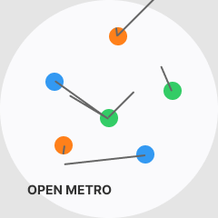
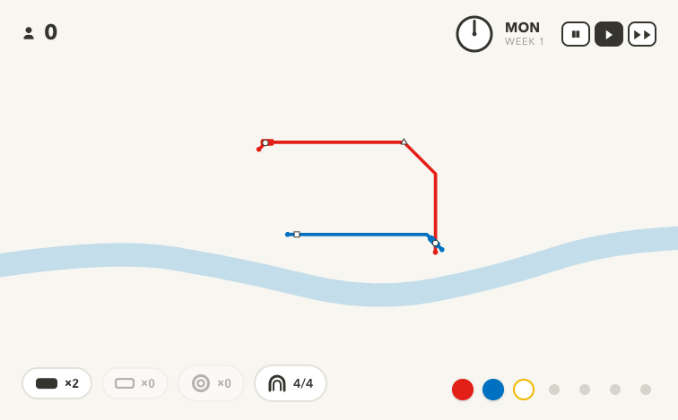
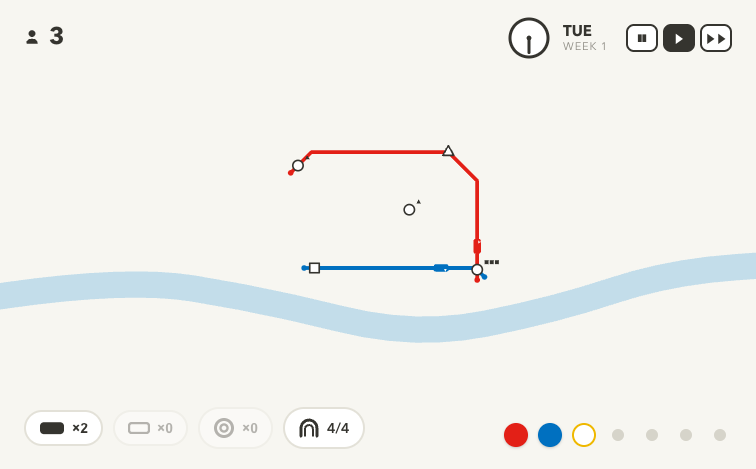
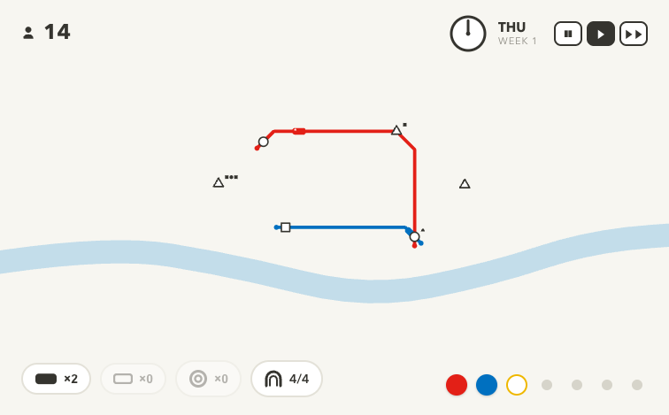

# Open Metro

<div align="center">
  
  
  **A minimalist transit network strategy game**
  
  [](https://github.com/surajsau/Open-Metro)
  [](LICENSE)
  [](https://react.dev)

</div>

---

## About

**Open Metro** is an original, local-only fan remake of the iconic Mini Metro game. Build and manage efficient transit networks in beautiful cities using an intuitive, minimalist interface. Pure React + TypeScript with Canvas 2D rendering—no backend, no runtime dependencies beyond React and ReactDOM.

## 🎮 Features

- **Minimalist Design** — Clean, geometric aesthetic inspired by transit diagrams
- **Strategic Gameplay** — Extend metro lines to connect stations and manage passenger flow
- **Multiple Cities** — London, Mumbai, Tokyo, and custom maps with unique layouts
- **Real-time Simulation** — Watch passengers board and navigate the network in real-time
- **Fully Tested Core** — Game engine is fully unit-tested with comprehensive coverage
- **No Backend Required** — Runs entirely in the browser; no server needed

## 📸 Gameplay

<div align="center">
  
  
  
  
  *Build and expand your transit network from scratch*
</div>

## 🚀 Quick Start

### Install

```bash
npm install
```

### Dev Server

```bash
npm run dev
```

Open [http://localhost:5173](http://localhost:5173) in your browser.

**URL Params** (combinable):
- `?autostart` — Skip start screen
- `?demo` — Autostart + connect the 4 starter stations
- `?seed=N` — Deterministic map (for reproducible testing)
- `?ff=120` — Fast-forward 120 sim-seconds (useful for screenshots)
- `?city=london|mumbai|tokyo` — Choose a city

Example: `http://localhost:5173/?demo&seed=1&ff=60`

### Build

```bash
npm run build
```

TypeScript type-checking and Vite production bundle.

### Test

```bash
npm test
```

Run the full game-core test suite (vitest).

## 🏗️ Architecture

The codebase is organized into clean, focused layers:

- **`src/game/`** — Pure TypeScript game engine (no DOM dependencies)
  - `types.ts` — All game interfaces
  - `cities.ts` — 3 city maps with water polylines and spawn timing
  - `geometry.ts` — Octilinear paths, arc-length walking, miter offsets
  - `routing.ts` — Per-shape BFS distance fields and passenger routing
  - `lines.ts` — Line editing (create, extend, remove); tunnel costs derived from usage
  - `trains.ts` — Movement simulation and dwell-exchange FSM
  - `sim.ts` — Game clock, spawn rates, rewards, overcrowding, adaptive pressure
  - `state.ts` — Centralized state management
  - `stepGame()` — Core loop that advances everything by dt

- **`src/store.ts`** — GameStore with external React subscription
  - Owns game state + `tick(ts)` method
  - React subscribes via `useSyncExternalStore` with version-compared snapshots (HUD fields only)
  - Best scores saved to localStorage

- **`src/render/`** — Canvas rendering
  - `renderer.ts` — Full draw pass each rAF; reads state directly, never through React

- **`src/input/`** — Pointer interaction layer
  - `interactions.ts` — Pointer state machine (new line, extend, insert, remove)
  - `dragState.ts` — Shared interaction types

- **`src/ui/`** — React components
  - HUD overlays and modals

## 🎨 Design Philosophy

- **Game-core changes are test-first** — Write tests in `src/**/__tests__/` before implementation
- **Canvas and UI are screenshot-verified** — Run the app and validate visually; no DOM/canvas mocking
- **Fixed world space** — 1600×1000 canvas, letterboxed for any screen size
- **No synthetic dependencies** — React, React-DOM, and standard browser APIs only

## 📋 Development

### Type Safety

Full TypeScript with zero `any` types. `npm run build` runs `tsc --noEmit` before bundling.

### Testing

Game core is fully tested. Canvas and UI are verified by running the app and taking headless screenshots:

```bash
"/Applications/Google Chrome.app/Contents/MacOS/Google Chrome" --headless --screenshot=/tmp/x.png \
  "http://localhost:5173/?demo&seed=1&ff=60"
```

## 🤝 Contributing

Contributions are welcome! Please ensure:
- New features include unit tests
- Canvas changes are verified via screenshots
- Commit messages are descriptive
- Code follows the existing style

## 📄 License

MIT License — see LICENSE file for details.

## 🎯 Roadmap

- [ ] Multiplayer via WebRTC
- [ ] Custom city editor
- [ ] Mobile touch controls
- [ ] Sound and music system
- [ ] Replay system

---

<div align="center">
  Built with ❤️ as a fan remake of Mini Metro
</div>
