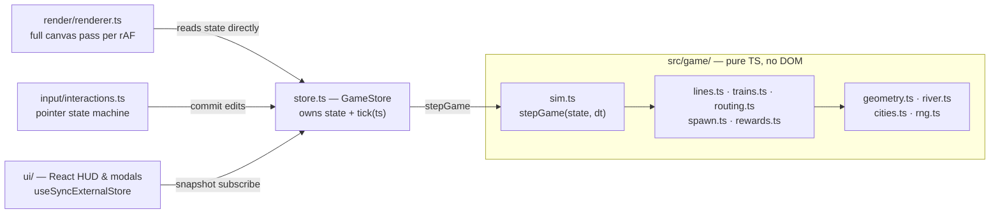

# Product Overview

## What this is

**Open Metro** is an original, local-only fan remake of the Mini Metro core game loop. The
player draws colored metro lines between procedurally spawning stations, trains carry
shape-coded passengers to matching stations, and the run ends when any station stays
overcrowded too long. It is a browser game served by a Vite dev server or static build — no
backend, no accounts, no network play.

| | |
|---|---|
| **Product name** | Open Metro (repo: `mini-metro`) |
| **Platform** | Desktop browser, mouse-first |
| **Distribution** | Local (`npm run dev`) or static bundle (`npm run build`) |
| **Runtime dependencies** | `react`, `react-dom` only |
| **Modes** | Normal (overcrowding ends the run), Endless (manual end) |
| **Cities** | London (easy), Mumbai (medium), Tokyo (hard) |

## Vision

A faithful re-creation of the *feel* of Mini Metro — calm surface, mounting pressure — that is
also a model codebase: a pure, deterministic, fully unit-tested TypeScript game core with thin
rendering/input/UI shells around it.

### Product pillars

1. **Legible minimalism.** Everything on screen is game state: shapes are demand, line colors
   are routes, the pie gauge is the lose condition. No decorative noise. Original,
   programmatically drawn art only.
2. **One more redesign.** The core tension is topology under scarcity — line slots, tunnels,
   locomotives, and carriages are all scarce, and every weekly reward forces a choice.
3. **Pressure that adapts.** Difficulty ramps with days and city pacing, but an adaptive
   pressure factor (mercy when drowning, push when cruising) keeps runs tense rather than
   spiky (see [World Generation §Adaptive difficulty](03-world-generation.md#adaptive-difficulty)).
4. **Determinism as a feature.** A seeded RNG plus a fixed-step-friendly sim makes every run
   reproducible — for tests, screenshots, and bug reports alike
   (see [Game Engine](02-game-engine.md)).

## Constraints

| ID | Constraint |
|----|-----------|
| PRD-01 | All code and art are original. The game is presented as an unofficial fan remake ("local play only" on the start screen); it must not ship Mini Metro assets, fonts, sounds, or trade dress. |
| PRD-02 | No backend and no runtime dependencies beyond `react`/`react-dom`. Persistence is limited to `localStorage` best scores. |
| PRD-03 | The game core (`src/game/`) must stay free of DOM and React imports so it runs headless under Vitest and in fast-forward scripts. |
| PRD-04 | World space is fixed at 1600×1000 units, letterboxed to the window. All gameplay coordinates are world units. |
| PRD-05 | Desktop mouse/trackpad is the supported input. Touch ergonomics are out of scope for v1. |

## Success criteria (v1 — met)

A full session is playable end to end: stations spawn over time; the player draws, extends,
retracts, inserts into, and deletes lines; trains carry shape-passengers with natural
transfers; water crossings consume tunnels; overcrowding ends the game with a score; weekly
rewards grant a locomotive plus a chosen upgrade; inventory items are drag-applied;
pause/1×/2× work; runs are restartable across three cities with per-city best scores.
`npm test` green, `tsc --noEmit` clean.

## Out of scope (v1) and roadmap

Out of scope: audio, daily challenges, mobile touch ergonomics, save/load of runs in progress,
leaderboards, achievements. (Moving a deployed train between lines — picking it up off the
canvas and re-dropping it while paused — is now in scope; see [GD-43](01-game-design.md#trains--carriages).)

Roadmap candidates (from the repo README, not yet specced): multiplayer via WebRTC, custom
city editor, mobile touch controls, sound and music, replay system. Each needs its own PRD
(status `draft`) before implementation.

## Architecture at a glance

Component responsibilities and their requirements live in PRDs [02](02-game-engine.md)–[08](08-ui-shell.md).
